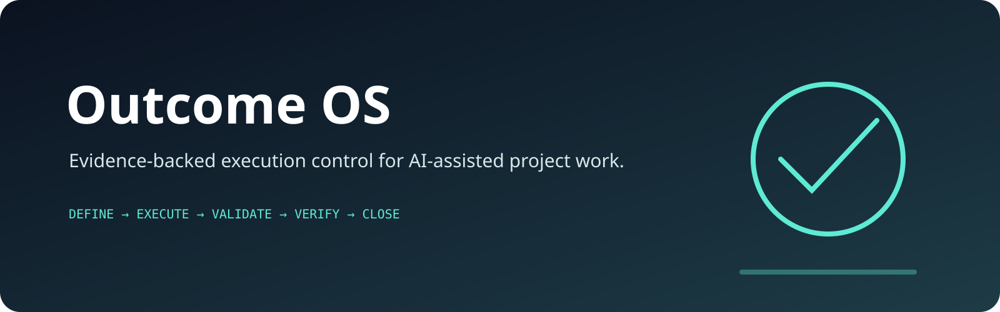

<p align="center">
  
</p>

# Outcome OS

**Evidence-backed execution control for AI-assisted project work.**

Outcome OS is a local-first control plane that keeps an AI or human operator working toward a persistent goal until every measurable completion gate is satisfied.

It solves a recurring failure mode in long-running AI work: implementation may be produced, but the original objective, remaining criteria, validation evidence, blockers, merge state, or administrative closure can drift out of view. Outcome OS keeps those elements in one auditable state machine.

## Core loop

```text
Define → Prioritize → Execute → Validate → Verify → Close → Learn
   ↑                                |
   └──────── remaining criteria ────┘
```

A goal is complete only when:

- every completion criterion has sufficient concrete evidence;
- all criterion-required checks pass;
- every work item is completed or explicitly skipped;
- no blocker remains open;
- aggregate confidence meets the configured threshold.

A prose claim such as “done” cannot bypass these gates.

## Features

- Persistent goal, criterion, work-item, check, blocker, and decision state
- Append-only SHA-256 hash-chained audit ledger
- Deterministic completion verification
- Shell-command validation with captured exit codes and bounded output
- Portfolio OS backlog import with stable-ID deduplication
- Work and verifier prompt generation for AI agents
- Explicit blocker and escalation handling
- Self-contained offline HTML dashboard
- JSON goal-profile bootstrap
- Standard-library Python core with no hosted dependency
- Cross-platform CI on Linux, Windows, and macOS

## Install

Requires Python 3.11 or newer.

```bash
python -m pip install -e .
```

Installed commands:

```bash
outcome-os --help
outcome-os-init-file --help
```

The core can also run without installation:

```bash
python outcome_os.py --help
```

## Quick start

Create a goal manually:

```bash
mkdir my-outcome && cd my-outcome

outcome-os init "Ship verified feature" \
  --objective "Implement, validate, merge, and document the requested feature" \
  --repo owner/repository \
  --criterion "The implementation covers the accepted scope" \
  --criterion "All required tests and checks pass" \
  --criterion "The change is merged into the default branch" \
  --criterion "The linked work item is correctly closed with evidence"
```

Add work:

```bash
outcome-os add-item "Implement the bounded change" --priority 100
outcome-os add-item "Run repository qualification" --priority 90
```

Record progress and evidence:

```bash
outcome-os set-item w-12345678 active
outcome-os run-check unit-tests "python -m unittest discover -s tests -v"
outcome-os evidence c-12345678 "Commit abc123 implements the accepted scope" \
  --type commit --source github
outcome-os set-item w-12345678 done --note "Implementation and validation complete"
```

Verify the complete original goal:

```bash
outcome-os verify
```

Verification returns exit code `0` only when every gate passes. An incomplete goal returns exit code `2`.

## Start from a goal profile

The repository includes a ready-to-use Medusa issue-to-merge profile:

```bash
outcome-os-init-file examples/medusa-goal.json --path medusa-outcome
cd medusa-outcome
outcome-os status
```

A profile defines the objective, repository, confidence threshold, criteria, maximum cycles, and operating rules.

## Portfolio OS bridge

Import a generated Portfolio OS backlog:

```bash
outcome-os import-portfolio ~/.portfolio-os/backlog/backlog.json
```

Outcome OS accepts common backlog shapes, normalizes titles, stable IDs, priorities, and acceptance criteria, and avoids duplicating previously imported work.

```text
Portfolio OS      → discovers and prioritizes evidence-backed work
Outcome OS        → owns execution state, evidence, verification, and escalation
AI or human agent → performs the current bounded action
GitHub and CI     → provide external implementation and validation evidence
```

## Agent prompts

Generate a prompt for the next work turn:

```bash
outcome-os prompt work_prompt
```

Generate a strict whole-goal verification prompt:

```bash
outcome-os prompt verify_prompt
```

Both prompts restore the original objective, full definition of done, current queue, remaining criteria, evidence requirements, blockers, and verifier-selected next action.

## Dashboard and integrity

Generate a self-contained dashboard:

```bash
outcome-os dashboard
```

Validate state structure and the complete event hash chain:

```bash
outcome-os doctor
```

Runtime state is stored locally under `.outcome-os/` and excluded from version control by default.

## Commands

```text
init                Create a workspace and persistent goal
add-item            Add a prioritized work item
set-item            Change a work-item state
evidence            Attach evidence to a completion criterion
check               Record an external validation result
run-check           Execute and record a shell validation command
blocker             Open an explicit blocker
resolve-blocker     Resolve a blocker with a recorded explanation
import-portfolio    Import a Portfolio OS backlog
status              Show current progress and next action
verify              Evaluate all completion gates
prompt              Generate work or verifier prompts
dashboard           Generate an offline HTML dashboard
doctor              Validate state and the audit ledger
```

## Repository structure

```text
outcome_os.py                    CLI, state machine, verifier, ledger, dashboard
profile_bootstrap.py             JSON goal-profile bootstrap
examples/medusa-goal.json        Medusa issue-to-merge goal profile
examples/portfolio-backlog.json  Portfolio import example
scripts/run-medusa-loop.sh       Bounded operator loop
scripts/demo.sh                  Reproducible end-to-end demonstration
docs/OPERATING_MODEL.md          Roles, gates, escalation, and operating rhythm
docs/GOAL_DESIGN.md              Guidance for measurable, verifiable goals
tests/                            Deterministic unit tests
.github/workflows/ci.yml          Cross-platform continuous integration
```

## Development

```bash
python -m compileall -q outcome_os.py profile_bootstrap.py
python -m unittest discover -s tests -v
python -m pip install .
outcome-os --version
```

The test suite covers completion gates, evidence requirements, required checks, blockers, Portfolio OS normalization, ledger chaining and tamper detection, offline dashboard generation, and profile bootstrapping.

## Safety model

Outcome OS does not bypass authentication, protected branches, reviews, tool permissions, safety policies, or confirmation requirements. Work that cannot proceed is recorded as a blocker rather than silently treated as complete. Destructive actions remain outside the automatic core.

## License

MIT
